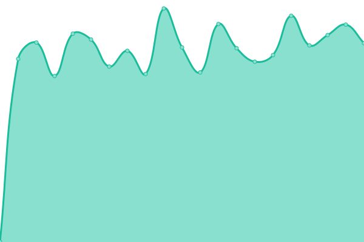
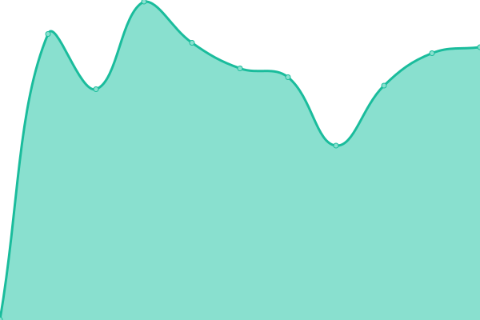
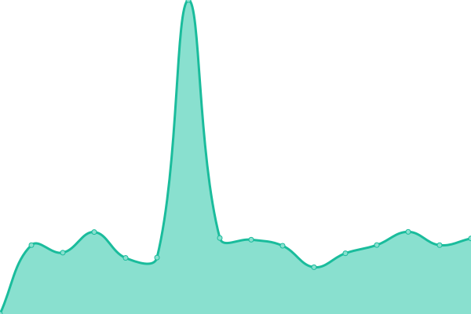
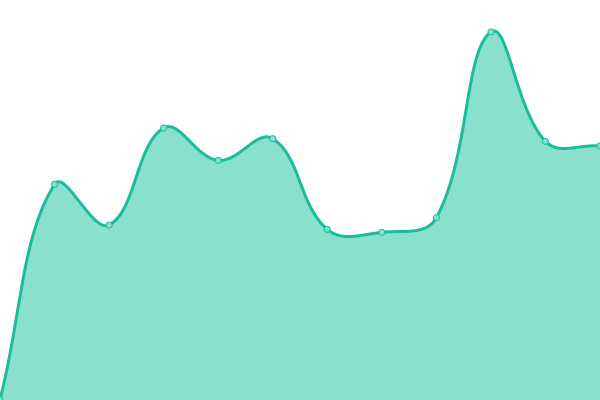

# [📈 Sitios Status](https://bomberosalas.github.io/status): <!--live status--> **🟧 Partial outage**

This repository contains the open-source uptime monitor and status page for [bomberosalas](https://bomberosalas.github.io/status), powered by [Upptime](https://github.com/upptime/upptime).

With [Upptime](https://upptime.js.org), you can get your own unlimited and free uptime monitor and status page, powered entirely by a GitHub repository. We use [Issues](https://github.com/bomberosalas/status/issues) as incident reports, [Actions](https://github.com/bomberosalas/status/actions) as uptime monitors, and [Pages](https://bomberosalas.github.io/status) for the status page.

<!--start: status pages-->
<!-- This summary is generated by Upptime (https://github.com/upptime/upptime) -->
<!-- Do not edit this manually, your changes will be overwritten -->
<!-- prettier-ignore -->
| URL | Status | History | Response Time | Uptime |
| --- | ------ | ------- | ------------- | ------ |
|  [Personal](https://www.csalas.cl) | 🟩 Up | [personal.yml](https://github.com/bomberosalas/status/commits/HEAD/history/personal.yml) | 

 952ms
     
 | 

<a href="https://bomberosalas.github.io/status/history/personal">100.00%</a>
    

|  [Mapas](https://maps.csalas.cl) | 🟩 Up | [mapas.yml](https://github.com/bomberosalas/status/commits/HEAD/history/mapas.yml) | 

 737ms
     
 | 

<a href="https://bomberosalas.github.io/status/history/mapas">100.00%</a>
    

|  [Segunda Cia Bomberos](https://2da.cl) | 🟥 Down | [segunda-cia-bomberos.yml](https://github.com/bomberosalas/status/commits/HEAD/history/segunda-cia-bomberos.yml) | 

 942ms
     
 | 

<a href="https://bomberosalas.github.io/status/history/segunda-cia-bomberos">99.48%</a>
    

|  [Bomberos Coyhaique](https://bomberoscoyhaique.cl) | 🟥 Down | [bomberos-coyhaique.yml](https://github.com/bomberosalas/status/commits/HEAD/history/bomberos-coyhaique.yml) | 

 891ms
     
 | 

<a href="https://bomberosalas.github.io/status/history/bomberos-coyhaique">99.65%</a>
    

|  [Grifos](https://grifos.cl) | 🟥 Down | [grifos.yml](https://github.com/bomberosalas/status/commits/HEAD/history/grifos.yml) | 

 1079ms
     
 | 

<a href="https://bomberosalas.github.io/status/history/grifos">99.81%</a>
    

<!--end: status pages-->

[**Visit our status website →**](https://bomberosalas.github.io/status)

## 📄 License

- Powered by: [Upptime](https://github.com/upptime/upptime)
- Code: [MIT](./LICENSE) © [bomberosalas](https://bomberosalas.github.io/status)
- Data in the `./history` directory: [Open Database License](https://opendatacommons.org/licenses/odbl/1-0/)
